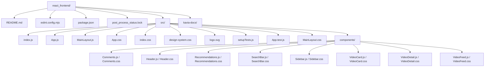

# File Structure Overview for `react_frontend`

This document provides a beginner-friendly explanation of the folder and file organization within the `react_frontend` container of this YouTube-like web application. Whether you're new to React or just want to understand this project structure, this guide will help you find your way around the codebase.

---

## Table of Contents
1. [Top-Level Structure](#top-level-structure)
2. [Main Project Files](#main-project-files)
3. [The `src/` Folder](#the-src-folder)
    - [Entry Points](#entry-points)
    - [Component Architecture](#component-architecture)
    - [Styling](#styling)
    - [Assets](#assets)
4. [Development Config & Utilities](#development-config--utilities)
5. [Summary Folder Diagram](#summary-folder-diagram)

---

## Top-Level Structure

At the root of the `react_frontend` container (`videostream-platform-9774-9783/react_frontend/`), you'll find the starting point for the frontend web application. The most important folders and files are:

- `README.md`: Basic instructions about the project features and how to run it.
- `package.json`: Manages dependencies, scripts, and settings for the Node.js React app.
- `eslint.config.mjs`: Configuration for JavaScript linting to maintain code quality.
- `post_process_status.lock`: Internal lock file related to processing/build status.
- `src/`: The source code for the actual React application. **This is where you’ll do most of your work.**

---

## Main Project Files

- **README.md**
  - Explains the project purpose and how to run, build, or test the application. Good starting point for any developer.

- **package.json**
  - Central dependency and script manager for the app. Handles which packages are installed (like React), and the scripts to start or build the site (`npm start`, `npm run build`, etc.).

- **eslint.config.mjs**
  - Sets rules for code style checking, making sure all JavaScript code follows the same conventions.

---

## The `src/` Folder

This folder holds all the source code—components, CSS, images, and app logic.

### Entry Points

- **index.js**
  - The main entry point that renders the React app into the page. Imports global CSS files and the root `<App />` component.

- **App.js**
  - The root React component. Handles simple routing between the video feed and video detail view for demo purposes. You could extend this with a more advanced router in the future.

### Component Architecture

- **MainLayout.js**
  - A layout wrapper providing the overall structure: includes the `Header`, `Sidebar`, and space for main content.
- **components/**
  - Contains reusable UI building blocks or "widgets" for the app. Each component typically has a JavaScript file (logic) and a matching CSS file (styling):
    - **Comments.js / Comments.css**: Shows video comments.
    - **Header.js / Header.css**: Navigation bar with logo, search, and user buttons.
    - **Recommendations.js / Recommendations.css**: Suggested videos sidebar.
    - **SearchBar.js / SearchBar.css**: Input to look for videos.
    - **Sidebar.js / Sidebar.css**: Vertical navigation, main links.
    - **VideoCard.js / VideoCard.css**: Shows preview cards for each video.
    - **VideoDetail.js / VideoDetail.css**: Full video detail page (player, info, comments, etc.).
    - **VideoFeed.js / VideoFeed.css**: The main video grid/feed for home.
  
  **How Components Work Together:**
  - `<App />` provides the top-level logic.
  - `<MainLayout />` renders the header and sidebar.
  - Depending on state, either `<VideoFeed />` (the grid) or `<VideoDetail />` (playing a specific video) shows as the main content.
  - Other components like Comments or Recommendations are embedded in detail pages.

### Styling

The project uses several CSS files for a consistent look:

- **App.css:** Basic theme variables and high-level style for the app (backgrounds, transitions, color schemes).
- **design-system.css:** Contains the bulk of design tokens (colors, font sizes, spacings, and common classes). This is where the application's visual identity is primarily defined.
- **index.css:** Contains global resets and font settings.
- **MainLayout.css, [Component].css:** Local styles for layouts and individual React components.

### Assets

- **logo.svg:** The SVG logo used in the app's header.
- *Note:* There is no dedicated `assets` directory by default, but more assets (images, icons) could be added there or alongside components.

---

## Development Config & Utilities

- **App.test.js / setupTests.js**
  - Contains example test files for setting up and running basic tests with React Testing Library and Jest.

---

## Summary Folder Diagram

Below is a diagram summarizing the key folder and file structure for orientation:

---

## Getting Started

- To run the application, follow the instructions in `README.md` (typically: `npm install`, then `npm start` to run locally).
- All main feature development happens within the `src/` folder.

---

## Tips for Beginners

- **Experiment Safely:** Try editing small things in `App.js` or `components/` to see how the pages change.
- **Learn React:** Each component is a self-contained piece of UI. Start with `VideoFeed.js` or `VideoCard.js` for simple examples.
- **Styling:** Try changing a CSS variable in `App.css` or `design-system.css` to see how theming works.

---

With this structure, you'll be able to easily add new features, modify layouts, or debug issues as you work on the frontend. Welcome to the project!
